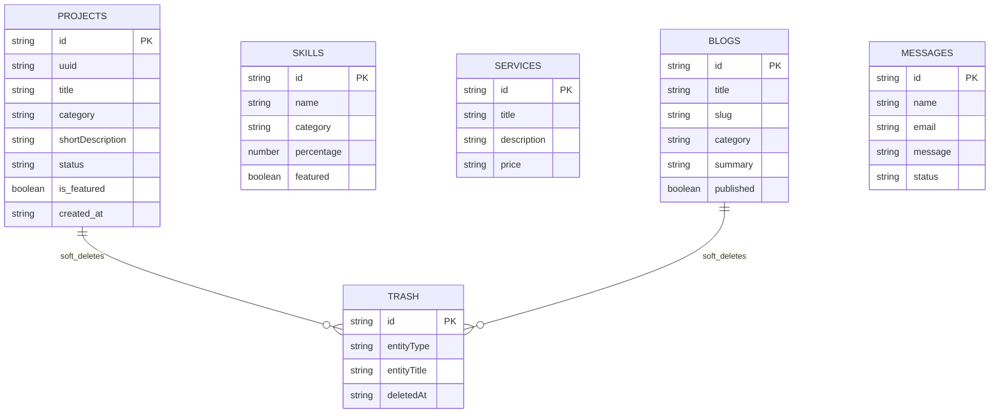

# Enterprise SaaS Portfolio Platform — Architecture & Documentation

## System Architecture Diagram

```mermaid
graph TD
    Client[Browser Client] -->|Vite Single Page App| ReactApp[React + TypeScript Core]
    ReactApp -->|Local Persistence| DataStore[DataStore Manager (db.ts)]
    ReactApp -->|Cloud Backup & Storage| Supabase[Supabase PostgreSQL & Storage]
    
    subgraph Enterprise Modules
      ReactApp --> SetupWizard[Setup Wizard]
      ReactApp --> FeatureToggle[Feature Manager]
      ReactApp --> PageBuilder[Dynamic Page Builder]
      ReactApp --> Widgets[Interactive Widget Engine]
      ReactApp --> MediaStudio[Image Processing & Canvas Studio]
      ReactApp --> AIStudio[AI Content Studio & Importers]
      ReactApp --> SEOAudit[SEO & Broken Link Diagnostics]
    end
```

## Relational Database ER Diagram



## Developer & Deployment Guide

1. **Local Development**:
   Run `npm run dev` to start Vite development server.
2. **Build Verification**:
   Run `npm run build` to verify TypeScript types and bundle optimization.
3. **Docker Deployment**:
   Run `docker-compose up -d --build` to launch the multi-stage Nginx container.
